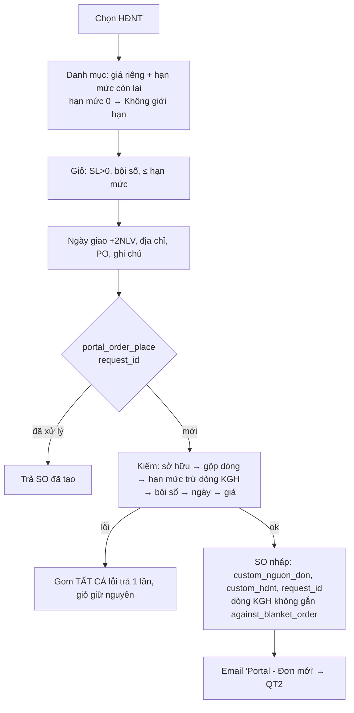

# PRD E1 — Đặt hàng theo HĐNT & hạn mức (QT1)

| Meta | Nội dung |
|---|---|
| Phạm vi | UC-01…05, UC-14 · BR-O1…O8 [Hiện có], BR-O11, O12, O13, O15 [MỚI] · NL-1.1…1.11 |
| Tham chiếu | BA §4.1, §6.1 · FormSpec F-03, F-04, F-05 · Prototype màn `cat`, `cart` |
| Trạng thái | Luồng lõi [Hiện có] — epic này **mở rộng**, không viết lại |

## Mục tiêu
Khách đặt đúng hàng trong HĐNT, đúng giá, trong hạn mức; các lỗ hổng thao tác (trùng đơn, sai bội số,
ngày giao sai, hạn mức 0) được chặn từ thiết kế.

## Điểm nối [Hiện có] — KHÔNG code lại
`portal_order_place` đã: kiểm sở hữu HĐNT/địa chỉ (BR-O1), gộp dòng trùng mã trước khi kiểm hạn mức
(BR-O2), gom mọi lỗi báo một lần (BR-O3), kho xuất theo từng mặt hàng (BR-O4), chặn thiếu giá (BR-O5),
trừ hạn mức qua `against_blanket_order` (BR-O6), tạo SO nháp + email.

## User stories & Acceptance Criteria

### US-E1.1 — Chống tạo đơn trùng (BR-O12) [MỚI]
Là người đặt hàng, khi mạng chập chờn lúc bấm "Xác nhận đặt hàng", tôi không muốn tạo 2 đơn giống nhau.
```gherkin
Given giỏ hợp lệ và màn xác nhận đã sinh request_id R1
When client gọi portal_order_place(request_id=R1) lần 1 thành công tạo SO-A
And gọi lại portal_order_place(request_id=R1) (retry/bấm lại)
Then hệ trả về SO-A (HTTP 200, cờ da_ton_tai=true), KHÔNG tạo SO thứ hai

Given custom_request_id là unique trên Sales Order
When hai request R1 song song cùng lúc
Then chỉ một SO được tạo; request thua nhận về SO đã tạo
```

### US-E1.2 — Bội số quy cách & ngày giao (BR-O11, O13) [MỚI]
```gherkin
Given mặt hàng VT0003 khai bội số đặt = 10
When khách nhập SL 15 (ở giỏ hoặc gửi thẳng API)
Then dòng bị chặn với thông điệp nêu bội số 10 và gợi ý 20; server là chốt cuối

Given hôm nay là Thứ Năm 30/07
When mở giỏ hàng
Then ngày giao mặc định = Thứ Hai 03/08 (+2 ngày làm việc, bỏ T7/CN)
And chọn ngày quá khứ → chặn tại trường và tại server
```

### US-E1.3 — Hạn mức 0 = KHÔNG GIỚI HẠN (BR-O15, QĐ-8) [MỚI]
```gherkin
Given dòng Blanket Order của VT0009 có qty = 0
When khách mở danh mục
Then cột hạn mức hiển thị badge "Không giới hạn" + "đã đặt n ĐVT" (không progress bar, không khoá SL)
When khách đặt 1.000 ĐVT
Then đơn tạo thành công; dòng SO KHÔNG gắn against_blanket_order; vẫn gắn custom_hdnt
And cảnh báo dùng ≥80% và % hạn mức Dashboard/Hồ sơ bỏ qua dòng này

Given dòng VT0002 hạn mức 200 đã đặt đủ 200
Then hiển thị "Hết hạn mức" và chặn — phân biệt rõ với trường hợp khai 0
```

### US-E1.4 — Thiếu giá → báo sales (NL-1.4 mở rộng) [MỚI]
```gherkin
Given VT0031 không có Item Price trong Price List của khách
When khách xem danh mục / cố đặt
Then dòng disable "Chưa có giá — đã báo Miyano"; đặt bị chặn nêu rõ mã
And Notification "Portal - Thiếu giá" gửi sales phụ trách (mỗi (khách, item) tối đa 1 lần/ngày)
```

### US-E1.5 — Đặt lại theo đơn cũ (UC-14, `portal_reorder`) [MỚI]
```gherkin
Given đơn SAL-ORD-2026-00131 đã Hoàn thành có 3 dòng
When khách bấm "Đặt lại đơn này"
Then giỏ được điền các dòng còn đặt được theo GIÁ HIỆN HÀNH
And dòng hết hạn mức / ngoài HĐNT hiện tại bị loại, thông báo liệt kê đủ các dòng bị loại
```

## Luồng (Mermaid)


## Ngoại lệ phải xử lý
NL-1.1…1.5 [Hiện có — có test rồi] · NL-1.6, 1.7, 1.8, 1.9 (giỏ server-side), 1.11 [MỚI — bảng chi tiết BA §4.1].

## Dữ liệu & API
- `Sales Order`: +`custom_request_id` (Data, unique), xem `20_DataDict.md` §4.
- `Customer Warehouse Item.boi_so_dat` dùng chung cho E5 (BR-P4); bội số đặt của item Miyano lấy từ Item.
- Endpoint sửa: `portal_order_place` (+`request_id`, kiểm mới) · mới: `portal_reorder` — `30_API_Spec.md`.

## DoD
Mọi AC pass bằng test tự động (nhóm TC-E1 trong `40_TestCases.md`) · 339 test cũ xanh ·
thông điệp lỗi đúng nguyên văn ma trận FormSpec §5 · patch idempotent · không vi phạm CLAUDE.md.
