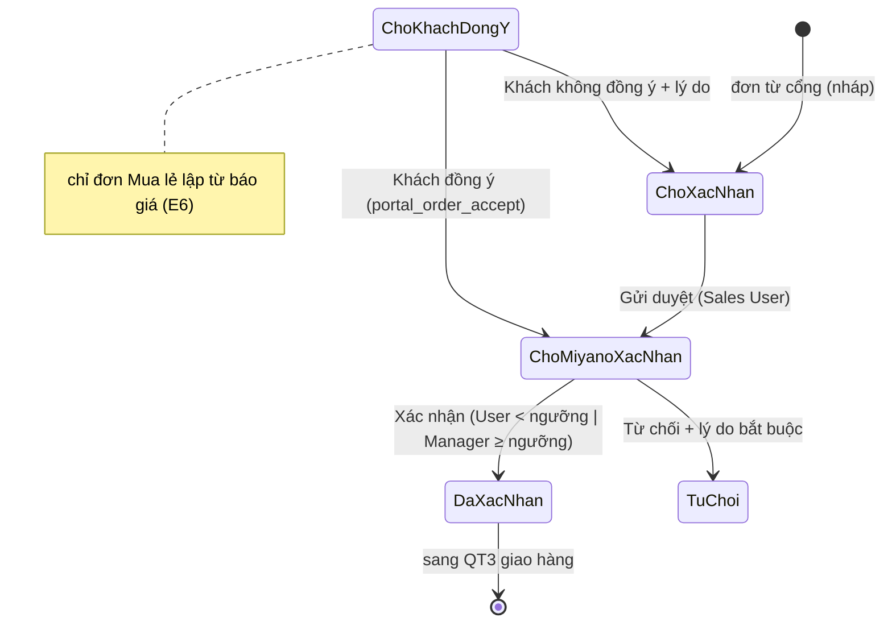

# PRD E2 — Duyệt đơn theo ngưỡng & máy trạng thái (QT2)

| Meta | Nội dung |
|---|---|
| Phạm vi | BR-O9, O14 [MỚI] · NL-2.1…2.8 · trạng thái "Chờ khách đồng ý" (dùng bởi E6) |
| Tham chiếu | BA §4.2 · Workflow HTML mục QT2 · QĐ-1, QĐ-6 |
| Trạng thái | Workflow [Hiện có] đang 1 tầng cho mọi đơn — epic này siết lại theo ngưỡng |

## Mục tiêu
Đơn nhỏ chạy nhanh (Sales User tự xác nhận), đơn lớn có kiểm soát (Sales Manager), đơn nào cũng
không bị bỏ quên (SLA), từ chối nào cũng có lý do đến tay khách.

## User stories & AC

### US-E2.1 — Duyệt theo ngưỡng (BR-O9) [MỚI]
```gherkin
Given Miyano Portal Settings.nguong_duyet_2_tang = 50.000.000
When Sales User bấm Xác nhận đơn grand_total = 49.000.000
Then chuyển "Đã xác nhận" (docstatus 1) bình thường

When Sales User bấm Xác nhận đơn grand_total = 50.000.000
Then workflow từ chối chuyển, thông điệp "Đơn ≥ 50.000.000 ₫ — cần Sales Manager xác nhận" (NL-2.5)
And Sales Manager xác nhận được đơn đó

Given nguong_duyet_2_tang để trống
Then mọi đơn một tầng như hiện tại (không phá hành vi cũ)
```
Hiện thực: điều kiện trên transition của Workflow `Sales Order - Client Portal` (đọc Settings),
cài bằng patch idempotent. Workflow vẫn áp mọi SO (VĐ-4 — chấp nhận).

### US-E2.2 — Từ chối bắt buộc lý do (BR-O14) [MỚI]
```gherkin
When người duyệt chọn Từ chối mà chưa nhập lý do
Then không chuyển được trạng thái, ô lý do bắt buộc (≥ 10 ký tự) → lưu custom_ly_do_tu_choi
When từ chối thành công
Then email "Portal - Đơn bị từ chối" kèm ĐÚNG lý do; cổng hiển thị lý do trên chi tiết đơn
```

### US-E2.3 — SLA đơn treo (NL-2.6) [MỚI]
```gherkin
Given Settings.sla_xu_ly_don_gio = 8 (giờ làm việc)
When đơn ở "Chờ Miyano xác nhận" quá 8 giờ làm việc
Then job nền (hourly) tạo Notification leo thang cho Sales Manager, mỗi đơn nhắc tối đa 1 lần/ngày
And đơn xuất hiện trong báo cáo "Đơn chậm xử lý"
```

### US-E2.4 — Đóng đơn giao dở & hoàn hạn mức (NL-2.8, VĐ-7) [MỚI — chờ chốt cơ chế]
```gherkin
Given đơn đã giao 60%, phần còn lại hai bên thống nhất không giao
When Miyano bấm Close Sales Order
Then trạng thái cổng hiển thị "Hoàn thành (đóng sớm)" + ghi chú
And [VĐ-7 — sau khi chủ đầu tư chốt] phần chưa giao được hoàn vào hạn mức Blanket Order
```
Code phần hiển thị trước; phần hoàn hạn mức chỉ làm khi VĐ-7 chốt — đánh dấu TODO tham chiếu VĐ-7.

### US-E2.5 — Trạng thái "Chờ khách đồng ý" (nền cho E6) [MỚI]
```gherkin
Given workflow bổ sung trạng thái "Chờ khách đồng ý" (docstatus 0)
When endpoint portal_order_accept(action=dong_y) chạy hợp lệ (đơn thuộc đúng khách, đúng trạng thái)
Then hệ chuyển sang "Chờ Miyano xác nhận" dưới quyền hệ thống, ghi log người bấm + thời điểm vào Comment
When action=khong_dong_y kèm lý do
Then chuyển về "Chờ xác nhận" (sales sửa), lý do lưu vào đơn
```

## Máy trạng thái (Mermaid)


## Dữ liệu & API
- `Sales Order`: +`custom_ly_do_tu_choi` (Small Text) · Workflow thêm state + 4 transition (patch).
- `Miyano Portal Settings`: `nguong_duyet_2_tang`, `sla_xu_ly_don_gio` — `20_DataDict.md` §3.
- Endpoint mới: `portal_order_accept` — `30_API_Spec.md`. Job: `scheduler_events.hourly`.

## DoD
AC pass (nhóm TC-E2) · workflow cài qua patch chạy lại được · đơn nội bộ (không từ cổng) không bị
ảnh hưởng ngoài việc đi qua máy trạng thái như trước · email lý do hiển thị đúng tiếng Việt.
