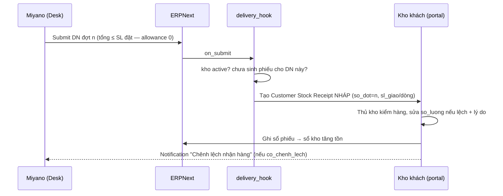

# PRD E3 — Giao nhiều đợt trên một đơn & đối soát giao–nhận (QT3)

| Meta | Nội dung |
|---|---|
| Phạm vi | UC-07 (mở rộng), UC-47, UC-48, UC-51 · BR-O10, K16, K17 [MỚI] · NL-3.1…3.10 · QĐ-2 |
| Tham chiếu | BA §4.3 · FormSpec F-07 (khối đợt giao), F-15 biến thể (a) |
| Trạng thái | Cơ chế nhiều DN/SO + hook sinh phiếu nháp [Hiện có] — mở rộng hiển thị + đối soát |

## Mục tiêu
Một đơn giao N đợt thì khách thấy đủ N đợt và N phiếu nhập tương ứng; nhận thiếu/hỏng có lý do,
Miyano biết ngay; không ai giao vượt số đặt.

## Điểm nối [Hiện có] — KHÔNG code lại
`delivery_hook.on_delivery_note_submit`: tìm kho active (dừng im lặng), chống sinh trùng theo DN
(BR-K11), khớp/tạo vật tư, lấy lô+hạn từ bundle, tạo `Customer Stock Receipt` NHÁP. Hook không bao giờ
ném lỗi (BR-K12). `on_cancel`: gỡ nháp / đảo phiếu đã ghi sổ.

## User stories & AC

### US-E3.1 — Chặn giao vượt (BR-O10, QĐ-2) [MỚI — cấu hình]
```gherkin
Given Selling Settings over_delivery_receipt_allowance = 0 (cài bằng patch)
And đơn có dòng VT0001 đặt 10, đã giao 6
When Miyano ghi sổ DN thứ hai với VT0001 = 5
Then ERPNext chặn submit (6+5 > 10); DN 4 thì thành công
```

### US-E3.2 — Hook ghi mốc đối soát (BR-K16) [MỚI]
```gherkin
Given SO có 2 DN đã ghi sổ trước đó (2 phiếu nhập đã sinh)
When DN thứ 3 của cùng SO ghi sổ
Then phiếu nhập nháp mới có so_dot = 3 (thứ tự DN đã ghi sổ trong phạm vi SO)
And mỗi dòng phiếu có sl_giao = SL trên dòng DN, so_luong (thực nhận) mặc định = sl_giao
And lỗi bất kỳ trong phần mở rộng này KHÔNG được ném ra ngoài (giữ BR-K12)
```

### US-E3.3 — Chênh lệch nhận (BR-K17, NL-3.3/3.10) [MỚI]
```gherkin
Given phiếu nhập nguồn Miyano có dòng sl_giao = 50
When thủ kho sửa so_luong = 48 và bỏ trống ly_do_chenh_lech
Then chặn lưu/ghi sổ: "Dòng {vt}: thực nhận 48 / giao 50. Nhập lý do chênh lệch để tiếp tục."
When nhập lý do "vỡ 2 hộp" rồi ghi sổ
Then phiếu gắn co_chenh_lech = 1; Notification "Chênh lệch nhận hàng" → sales phụ trách
And sổ kho ghi 48 (đúng thực nhận)

When thủ kho sửa so_luong = 52 (> sl_giao)
Then chặn: thực nhận không vượt số giao; nhận thừa thật → phiếu "Nhập khác" riêng
```

### US-E3.4 — Khách thấy từng đợt (UC-07 mở rộng) [MỚI]
```gherkin
Given đơn có 2 DN: đợt 1 đã ghi sổ (60%), đợt 2 đang soạn
When khách mở chi tiết đơn trên cổng
Then thấy danh sách đợt: "Đợt 1 — dd/mm (60%)" + số DN + link PDF + hãng/AWB nếu có
And nếu khách có kho: trạng thái phiếu nhập từng đợt — "PNK-xxx Nháp, chờ kiểm nhận" (link) /
    "Đã ghi sổ" / "Có chênh lệch ⚠"
And per_delivered tổng thể hiển thị đúng %
```

### US-E3.5 — Báo cáo đối soát giao–nhận (UC-48, Desk) [MỚI]
```gherkin
Given kỳ lọc có 3 DN, trong đó 1 phiếu nhập lệch (48/50) và 1 phiếu còn nháp
When nhân viên Miyano mở report "Đối soát giao – nhận"
Then mỗi dòng: DN · SO · khách · đợt · vật tư · SL giao · SL thực nhận · chênh · lý do · trạng thái phiếu
And lọc được "chỉ dòng chênh lệch" và "phiếu chưa ghi sổ quá N ngày"
```

### US-E3.6 — Cờ thiếu lô/hạn (NL-3.7, một phần UC-51) [MỚI]
```gherkin
When hook nhận dòng DN không có batch/hạn dùng
Then dòng phiếu ghi so_lo = "KHONG-LO", đánh dấu thieu_lo_han = 1 (không chặn)
And report "Chất lượng dữ liệu" (Desk) liệt kê item cần bật Has Batch No/Has Expiry Date
```

## Luồng (Mermaid)


## Dữ liệu & API
- `Customer Stock Receipt`: +`so_dot` (Int, read-only) · `Customer Stock Receipt Item`: +`sl_giao`
  (Float, read-only), +`ly_do_chenh_lech` (Data), dòng cha +`co_chenh_lech` (Check, hệ đặt),
  +`thieu_lo_han` (Check) — `20_DataDict.md` §2.
- `kho_phieu_nhap_save` mở rộng validate BR-K17 · `portal_order_track` trả thêm mảng `dot_giao[]` —
  `30_API_Spec.md`. Report mới: Đối soát giao–nhận (Query/Script Report, module kho).

## DoD
AC pass (TC-E3) · test hook: sinh 3 DN liên tiếp → đúng so_dot, không trùng phiếu, cancel giữa chừng
gỡ/đảo đúng · hook bọc _chay_an_toan cho phần mở rộng · 339 test cũ xanh.
