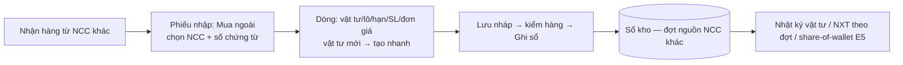

# PRD E4 — Kho khách hàng: NCC khác, đợt hàng, nhật ký vật tư (QT4/5/7/8)

| Meta | Nội dung |
|---|---|
| Phạm vi | UC-42, 43, 44 · BR-N1…N3, BR-D1…D3, BR-K19, K20, K21 [MỚI] · NL-4.4/4.5/4.9, NL-7.x, NL-8.x · VĐ-2 |
| Tham chiếu | BA §4.4, §4.7, §4.8 · FormSpec F-14…F-19 · Prototype màn kho |
| Trạng thái | Sổ kho/phiếu/FEFO/phiếu đảo/import [Hiện có] — epic thêm nguồn NCC + lớp phân tích đợt |

## Mục tiêu
Mọi đợt hàng về kho — Miyano hay NCC khác — vào cùng một sổ; mỗi vật tư có nhật ký đầy đủ;
mỗi đợt hàng biết đã tiêu thụ bao nhiêu, còn bao nhiêu, nằm kho bao lâu.

## User stories & AC

### US-E4.1 — Danh mục NCC của kho (UC-42, BR-N3) [MỚI]
```gherkin
When thủ kho tạo NCC "Cty ABC" trong kho của mình
Then NCC thuộc riêng kho đó; tên trùng tuyệt đối trong kho → chặn; gần giống → gợi ý chọn NCC có sẵn (NL-7.3)
When NCC đã dùng trên ≥1 phiếu
Then không xoá được, chỉ tắt active; NCC tắt không chọn được trên phiếu mới
```

### US-E4.2 — Phiếu nhập "Mua ngoài (NCC khác)" (BR-N1, N2) [MỚI]
```gherkin
When chọn loai_nhap = "Mua ngoài (NCC khác)" mà không chọn ncc
Then chặn lưu: "Chọn nhà cung cấp cho phiếu mua ngoài." (NL-7.1)
When bỏ trống so_chung_tu_ncc và lưu
Then vẫn lưu/ghi sổ được nhưng phiếu gắn thieu_chung_tu = 1; danh sách phiếu lọc được theo cờ (NL-7.2)
And loai_nhap có thêm "Điều chỉnh kiểm kê (tăng)" (BR-K19); "Phiếu đảo" vẫn KHÔNG chọn được tay (BR-K9)
```

### US-E4.3 — Tồn đầu kỳ chỉ một lần (BR-K21) [MỚI]
```gherkin
Given kho đã commit tồn đầu kỳ ngày 01/07
When thủ kho vào lại màn import tồn đầu kỳ
Then chặn từ bước upload: "Kho đã nhập tồn đầu kỳ ngày 01/07. Dùng phiếu Điều chỉnh kiểm kê cho chênh lệch."
```

### US-E4.4 — Cảnh báo xuất lô hết hạn (BR-K20, NL-4.9) [MỚI]
```gherkin
Given lô L123 hạn dùng 01/08/2026, ngày phiếu 12/08/2026, loai_xuat = "Xuất sử dụng"
When ghi sổ phiếu có dòng lấy lô L123
Then yêu cầu tick "Tôi xác nhận xuất lô quá hạn" (lưu xac_nhan_xuat_het_han) hoặc đổi loại
     "Xuất huỷ - hết hạn"; không tick → chặn ghi sổ; các loại xuất khác không hỏi
```

### US-E4.5 — Cảnh báo trùng tên vật tư (NL-4.5) [MỚI]
```gherkin
When tạo vật tư tên giống ≥85% vật tư đang có (so không dấu)
Then cảnh báo mềm liệt kê các vật tư giống, [Vẫn tạo]/[Huỷ] — không chặn cứng
```

### US-E4.6 — Nhật ký vật tư (UC-43, BR-D2) [MỚI]
```gherkin
Given vật tư có 12 dòng sổ trong kỳ, trong đó 2 dòng da_dao = 1
When mở /portal/kho/nhat-ky chọn vật tư + kỳ
Then bảng thời gian: ngày · phiếu(link) · loại · nguồn/NCC · đợt · lô · hạn · SL nhập · SL xuất
     · đơn giá · TỒN SAU GIAO DỊCH (luỹ kế chạy) · người ghi sổ
And dòng da_dao hiển thị mờ + nhãn "đã đảo" (không giấu); chỉ đọc; phân trang server 50 dòng
And tồn sau giao dịch của dòng cuối = tồn hiện tại của vật tư (đối chiếu kho_ton)
```

### US-E4.7 — NXT theo đợt hàng, phân bổ FIFO (UC-44, BR-D1/D3) [MỚI]
Bộ số chuẩn để viết test:
```
Lô L1 của VT-A nhận 2 đợt: Đợt PNK-001 ngày 01/08 nhập 100; Đợt PNK-005 ngày 10/08 nhập 50.
Tổng đã xuất của lô L1: 120.
→ Phân bổ FIFO: PNK-001 tiêu thụ 100/100 (hết, còn 0); PNK-005 tiêu thụ 20/50 (còn 30).
Tuổi tồn PNK-005 = ngày_báo_cáo − 10/08. %TT PNK-001 = 100%, PNK-005 = 40%.
```
```gherkin
When chạy báo cáo NXT theo đợt với dữ liệu trên (ngày 30/09, ngưỡng chậm 30 ngày)
Then dòng PNK-001: còn 0, không cờ; dòng PNK-005: còn 30, tuổi 51 ngày, cờ "chậm luân chuyển"
And phiếu bị đảo: SL nhập của đợt trừ phần đã đảo (NL-8.2)
```

### US-E4.8 — Tách nhóm "Không có hạn dùng" trong cảnh báo hạn (VĐ-2) [MỚI — sửa lỗi]
```gherkin
Given lô không có han_su_dung
When chạy kho_canh_bao_han
Then lô đó vào nhóm riêng "Không có hạn dùng", KHÔNG bị tính "Sắp hết hạn/Đã hết hạn"
```
(Sửa `reports.canh_bao_han_rows`: bỏ hành vi `ifnull` kéo lô NULL vào phép so sánh `<= han_toi`.)

## Luồng phiếu mua ngoài (Mermaid)


## Dữ liệu & API
- Doctype mới `Customer Supplier` — `20_DataDict.md` §1. Trường mới trên Receipt/Issue — §2.
- Endpoint mới: `kho_ncc_list`, `kho_ncc_save`, `kho_nhat_ky`, `kho_bao_cao_dot` — `30_API_Spec.md`.
- `kho_phieu_list` thêm filter nguồn + cờ; `kho_canh_bao_han` sửa nhóm.

## DoD
AC pass (TC-E4, gồm bộ số FIFO ở trên) · nhật ký đối chiếu khớp `kho_ton`/`kho_the_kho` ·
phân quyền: NCC/nhật ký/đợt chỉ truy cập qua khuôn `get_portal_kho()` (test cách ly 2 khách).
