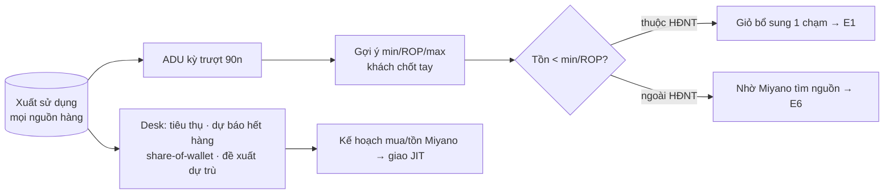

# PRD E5 — Dự trù & vòng lặp Just-in-Time (QT9)

| Meta | Nội dung |
|---|---|
| Phạm vi | UC-45, 46, 49, 50, 51 · BR-P1…P5 [MỚI] · NL-9.1…9.5 · VĐ-10 (consent) |
| Tham chiếu | BA §4.9 · FormSpec F-20 · Prototype màn `dutru` |
| Phụ thuộc | E4 (nguồn dữ liệu đợt/NCC) · dữ liệu Xuất sử dụng ≥ 30 ngày mới có giá trị |

## Mục tiêu
Từ tiêu thụ thật (mọi nguồn hàng) → gợi ý min/ROP/max → cảnh báo thiếu tồn → giỏ bổ sung 1 chạm.
Phía Miyano: báo cáo tiêu thụ, dự báo hết hàng, share-of-wallet, đề xuất dự trù.

## Công thức chuẩn (BR-P1, P2) — bộ số để viết test

```
ADU (mức dùng bình quân/ngày) = tổng SL "Xuất sử dụng" đã ghi sổ trong kỳ trượt N ngày / N
  · N = Settings.so_ngay_adu (mặc định 90); loại trừ phiếu đảo và dòng da_dao = 1
  · KHÔNG tính: Xuất huỷ, Xuất trả lại, Điều chỉnh kiểm kê (BR-P1, NL-9.4)
ROP = ADU × lead_time_ngay + ton_toi_thieu        (BR-P2)
SL gợi ý đặt = ton_toi_da − tồn khả dụng, LÀM TRÒN LÊN theo boi_so_dat  (BR-P4)
Ngày phủ tồn = tồn khả dụng / ADU (1 lẻ thập phân; ADU=0 → "—")

Ví dụ chuẩn: 90 ngày xuất sử dụng 450 hộp (+1 phiếu xuất huỷ 30 hộp — không tính)
→ ADU = 5/ngày. lead_time = 3, min (tồn an toàn) = 10 → ROP = 5×3+10 = 25.
max khách chốt = 60. Tồn hiện tại = 22 (< ROP) → trạng thái "Sắp thiếu";
SL gợi ý = 60−22 = 38, bội số 10 → 40. Ngày phủ = 22/5 = 4,4 ngày.
```

## User stories & AC

### US-E5.1 — Thiết lập min/max trên vật tư (UC-24 mở rộng, UC-46)
```gherkin
When mở form vật tư
Then có nhóm trường: ton_toi_thieu, diem_dat_lai, ton_toi_da, lead_time_ngay (mặc định 3), boi_so_dat
And validate min ≤ ROP ≤ max khi lưu
When bấm [Gợi ý từ tiêu thụ] (kho_min_max_goi_y)
Then điền 3 ô theo công thức + chú thích "ADU 90 ngày = x/ngày" — CHƯA lưu, người dùng xem rồi lưu
And vật tư < 30 ngày dữ liệu → trả "chưa đủ dữ liệu", không điền (NL-9.1)
```

### US-E5.2 — Màn dự trù & cảnh báo thiếu tồn (UC-45, BR-P3)
```gherkin
Given bộ số ví dụ chuẩn ở trên
When mở /portal/kho/du-tru
Then dòng vật tư hiển thị: tồn 22 · ADU30/ADU90 · ngày phủ 4,4 · min 10 · ROP 25 · max 60
     · badge "Sắp thiếu" (tồn < ROP); tồn < min → "Thiếu" đỏ
And 3 thẻ đếm: Thiếu tồn / Chạm điểm đặt lại / Chưa thiết lập — bấm lọc bảng
And vật tư chưa khai min/ROP và < 30 ngày dữ liệu → KHÔNG cảnh báo (BR-P3)
```

### US-E5.3 — Giỏ bổ sung 1 chạm (BR-P4)
```gherkin
Given vật tư "Sắp thiếu" có item_code thuộc HĐNT còn hiệu lực
When bấm [Thêm vào giỏ bổ sung] (chọn nhiều dòng được)
Then chuyển sang giỏ HĐNT với SL điền sẵn = 40 (đã làm tròn bội số) → tiếp luồng E1
Given vật tư ngoài HĐNT (kể cả vật tư riêng item_code rỗng)
Then thay bằng nút [Nhờ Miyano tìm nguồn] → tạo yêu cầu E6 điền sẵn (tên/quy cách/ĐVT/SL gợi ý)
```

### US-E5.4 — Job cảnh báo + email
```gherkin
When job daily chạy
Then vật tư dưới min/ROP ghi nhận để hiển thị thẻ Dashboard "Vật tư dưới mức tồn (n)"
And email tổng hợp gửi theo tần suất cấu hình (mặc định: tắt; bật theo kho)
```

### US-E5.5 — Báo cáo Desk cho Miyano (UC-49, 50, 51)
```gherkin
Then report "Tiêu thụ & đề xuất dự trù": khách · vật tư · ADU 30/90 · tồn · ngày phủ ·
     ngày dự kiến hết (tồn/ADU) · ROP/max · SL đề xuất — lọc theo khách/nhóm
And report "Tỷ trọng nguồn cung": giá trị + SL nhập theo nguồn (Miyano vs từng NCC) theo kỳ,
     từ phiếu nhập đã ghi sổ (loại trừ đảo)
And report "Chất lượng dữ liệu": kho không có phiếu xuất N ngày (NL-9.3) · dòng thiếu lô/hạn (E3)
     · phiếu thiếu chứng từ (E4)
```

## Vòng lặp (Mermaid)


## Dữ liệu & API
- `Customer Warehouse Item`: +5 trường min/max (DataDict §2) · `Miyano Portal Settings`: so_ngay_adu,
  so_ngay_du_lieu_toi_thieu, nguong_cham_luan_chuyen_ngay.
- Endpoint mới: `kho_canh_bao_ton`, `kho_min_max_goi_y` · 3 Script Report Desk · job daily.
- Ràng buộc pháp lý: report Desk đọc dữ liệu mua ngoài — chỉ triển khai cho khách đã ký điều khoản
  chia sẻ dữ liệu (VĐ-10); không chặn bằng code, quản bằng quy trình mở kho.

## DoD
AC pass với đúng bộ số ví dụ chuẩn (TC-E5) · ADU loại trừ đúng loại phiếu (test có phiếu đảo lẫn vào)
· màn dự trù phân trang server · report Desk lọc theo khách không rò sang khách khác.
