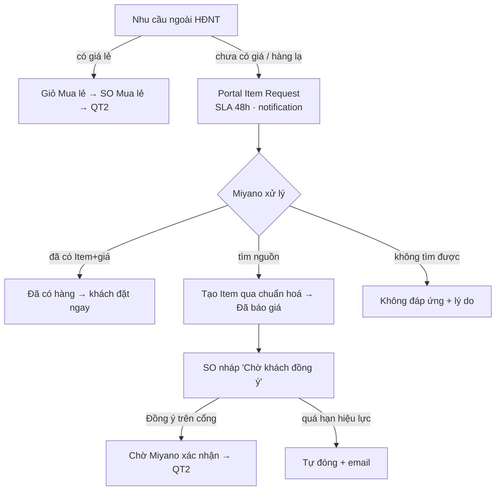

# PRD E6 — Mua lẻ ngoài HĐNT & Yêu cầu hàng hoá (QT10/QT11)

| Meta | Nội dung |
|---|---|
| Phạm vi | UC-15, 16, 17, 52, 53 · BR-R1…R7, BR-Y1…Y5 [MỚI] · NL-10.x, NL-11.x · QĐ-5, QĐ-6 · VĐ-12, VĐ-13 |
| Tham chiếu | BA §4.10, §4.11 · FormSpec F-21, F-22, F-23 + F-04 (giỏ 2 ngăn), F-07 (Chờ bạn đồng ý) |
| Phụ thuộc | E2 (trạng thái "Chờ khách đồng ý") · VĐ-12: Price List bán lẻ phải chuẩn hoá trước khi bật nhánh A |

## Mục tiêu
Nhu cầu ngoài HĐNT không rơi rớt: có giá lẻ thì đặt ngay; chưa có giá thì thành yêu cầu được định
tuyến, có SLA; hàng chưa từng bán thành demand pipeline cho purchasing.

## User stories & AC

### US-E6.1 — Bật mua lẻ theo khách + danh mục bán lẻ (BR-R1, R6)
```gherkin
Given Customer.custom_cho_phep_mua_le = 0 (mặc định)
Then cổng không hiển thị chế độ Mua lẻ; gọi portal_catalog_ban_le → 403 (NL-10.1)
Given bật cờ cho khách
Then bộ chuyển "Theo HĐNT | Mua lẻ" xuất hiện; danh mục lẻ chỉ gồm Item custom_ban_le_portal = 1
     có giá trong Settings.price_list_ban_le
And item có trong HĐNT còn hiệu lực của khách → dòng disable "Có trong HĐNT — đặt ở chế độ Theo HĐNT"
    (BR-R7, chống né hạn mức NL-10.7)
And item bật bán lẻ nhưng thiếu giá → nút [Yêu cầu báo giá] thay ô SL (NL-10.2)
```

### US-E6.2 — Giỏ 2 ngăn, đặt đơn lẻ (BR-R2, R3, R4)
```gherkin
When khách thêm hàng lẻ vào giỏ
Then vào ngăn "Mua lẻ" riêng; badge nav = tổng dòng 2 ngăn; mỗi ngăn xác nhận riêng → 2 SO riêng
When đặt ngăn Mua lẻ
Then SO có custom_loai_don="Mua lẻ", KHÔNG kiểm hạn mức, KHÔNG gắn against_blanket_order/custom_hdnt;
     vẫn kiểm sở hữu địa chỉ, bội số, ngày giao, request_id; đơn đi vào QT2 (duyệt ngưỡng áp dụng)
And server từ chối payload trộn dòng HĐNT + lẻ trong một đơn (NL-10.3)
```

### US-E6.3 — Yêu cầu hàng hoá: tạo từ 3 đường (UC-16, BR-Y5)
```gherkin
When tìm danh mục không kết quả → nút "Không tìm thấy? Gửi yêu cầu" (prefill từ khoá vào ten_hang)
When màn dự trù, vật tư ngoài HĐNT thiếu tồn → [Nhờ Miyano tìm nguồn] (prefill tên/quy cách/ĐVT/SL từ E5)
When danh mục lẻ item thiếu giá → [Yêu cầu báo giá] (loai="Báo giá mua lẻ")
Then form F-22: loai/ten_hang/dvt/so_luong_du_kien bắt buộc; tần suất Định kỳ → thêm chu_ky_thang;
     đính kèm ≤5 file ×10MB pdf/jpg/png/xlsx (NL-11.6); private file (BR-Y5)
And trùng gần đúng tên với yêu cầu đang mở → cảnh báo kèm mã, vẫn gửi được nếu cố ý (NL-11.1)
And tạo xong: notification sales phụ trách + Purchase User; email xác nhận cho khách
```

### US-E6.4 — Miyano xử lý yêu cầu (UC-52, BR-Y1…Y3)
```gherkin
Given trạng thái: Mới → Đang tìm nguồn → Cần thêm thông tin ⇄ → Đã báo giá / Đã có hàng →
      Đã chuyển thành đơn / Không đáp ứng được / Khách huỷ / Hết hạn
When quá Settings.sla_yeu_cau_gio (48h làm việc) chưa chuyển khỏi "Mới"
Then notification leo thang Sales Manager (NL-11.2); mỗi yêu cầu nhắc 1 lần/ngày
When chuyển "Cần thêm thông tin" kèm câu hỏi
Then khách nhận email, trả lời trên F-23 (comment 2 chiều) → trạng thái tự về "Đang tìm nguồn"
When chuyển "Không đáp ứng được"
Then bắt buộc ly_do_khong_dap_ung; email khách kèm đúng lý do (BR-Y2)
When purchasing tạo Item mới từ yêu cầu
Then Item ở trạng thái chưa mở bán cho tới khi người giữ chuẩn dữ liệu duyệt mã/tên/ĐVT/nhóm/VAT
     (BR-Y3 — quy trình, checklist trong form)
And mọi trạng thái kết thúc đều lưu, không xoá (BR-Y4)
```

### US-E6.5 — Báo giá → khách đồng ý trên cổng (BR-R5, QĐ-6)
```gherkin
Given sales lập SO nháp từ yêu cầu (custom_yeu_cau_goc set, custom_loai_don="Mua lẻ")
When đặt trạng thái "Chờ khách đồng ý"
Then khách thấy banner: giá trị + "Báo giá hiệu lực đến dd/mm/yyyy"
     (= ngày lập + Settings.hieu_luc_bao_gia_ngay)
When khách bấm Đồng ý → portal_order_accept
Then chuyển "Chờ Miyano xác nhận"; Comment log user + timestamp; yêu cầu gốc → "Đã chuyển thành đơn"
When khách Không đồng ý (lý do ≥10 ký tự)
Then về "Chờ xác nhận" cho sales sửa (NL-10.4)
When quá hạn hiệu lực
Then job daily huỷ nháp + email 2 phía; yêu cầu gốc → "Hết hạn" (NL-10.5)
```

### US-E6.6 — Báo cáo demand pipeline (UC-53)
```gherkin
Then report Desk: yêu cầu theo trạng thái/khách/nhóm · thời gian xử lý bình quân ·
     tỷ lệ chuyển thành đơn = Đã chuyển thành đơn / tổng kết thúc ·
     nhóm tần suất "Định kỳ" tách riêng (đề xuất đưa vào HĐNT — NL-11.7)
```

## Luồng (Mermaid)


## Dữ liệu & API
- Doctype mới `Portal Item Request` (DataDict §1) · custom fields: Customer.custom_cho_phep_mua_le,
  Item.custom_ban_le_portal, SO.custom_loai_don + custom_yeu_cau_goc (§4).
- Endpoint mới: `portal_catalog_ban_le`, `portal_yeu_cau_list/save/cancel`, `portal_order_accept`
  (API Spec) · jobs: SLA leo thang + hết hạn báo giá.

## DoD
AC pass (TC-E6) · test cách ly: khách A không thấy yêu cầu khách B · test né hạn mức BR-R7 ·
mặc định TẮT mua lẻ không đổi hành vi khách hiện hữu · VĐ-12/13 ghi rõ điều kiện bật.
