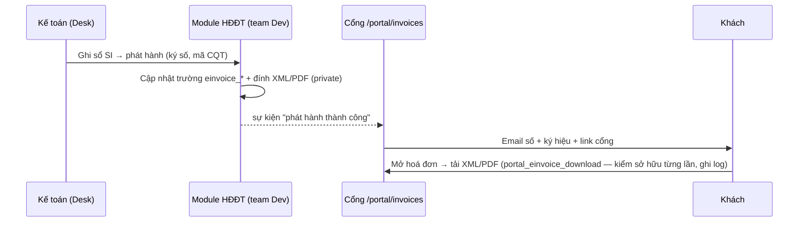

# PRD E7 — Hoá đơn điện tử trên cổng (QT12)

| Meta | Nội dung |
|---|---|
| Phạm vi | UC-18 · BR-E1…E5 [MỚI] · NL-12.1…12.6 · QĐ-7 |
| Tham chiếu | BA §4.12, §7.3 (data contract) · FormSpec F-08 khối HĐĐT |
| **CHẶN TRƯỚC KHI CODE** | **VĐ-11**: họp team Dev module HĐĐT chốt tên trường/sự kiện thực tế. Tên trong tài liệu là TÊN TẠM |

## Mục tiêu
Khách tự tải XML gốc + PDF + mã tra cứu ngay trên cổng; kế toán hai bên không gửi tay.
Cổng **chỉ đọc** (BR-E5) — phát hành/huỷ/điều chỉnh vẫn ở Desk qua module của team Dev.

## Hợp đồng dữ liệu (data contract — tên tạm, map lại sau VĐ-11)

| Trường trên `Sales Invoice` | Kiểu | Ghi chú |
|---|---|---|
| `einvoice_trang_thai` | Select | Chưa phát hành / Đã phát hành / Đã huỷ / Bị thay thế / Bị điều chỉnh |
| `einvoice_so`, `einvoice_ky_hieu` | Data | Số + mẫu số–ký hiệu (VD `1C26TAA`) |
| `einvoice_ma_tra_cuu` | Data | Mã tra cứu CQT/NCC dịch vụ |
| `einvoice_ngay_phat_hanh` | Datetime | — |
| `einvoice_file_xml`, `einvoice_file_pdf` | Attach (private) | XML = bản gốc pháp lý, PDF = bản thể hiện (NĐ 123/2020, TT 78/2021) |
| `einvoice_link_tra_cuu` | Data (URL) | Trang tra cứu công khai |
| `einvoice_lien_ket_goc` | Link Sales Invoice | Khi là hoá đơn thay thế/điều chỉnh |
| Sự kiện "phát hành thành công" | hook/event | Cổng bám vào để gửi email + refresh |

## User stories & AC

### US-E7.1 — Khối HĐĐT trên màn hoá đơn (BR-E2, E3)
```gherkin
Given SI đã ghi sổ, einvoice_trang_thai = "Chưa phát hành"
When khách mở /portal/invoices và xổ dòng
Then khối HĐĐT hiển thị "Đang phát hành HĐĐT" — KHÔNG có nút tải (NL-12.1); công nợ vẫn hiển thị

Given einvoice_trang_thai = "Đã phát hành"
Then hiển thị: số + ký hiệu · ngày · mã tra cứu (nút copy) · [⬇ XML gốc] [⬇ PDF] [🔗 Tra cứu]
And chú thích cố định: "File XML là bản gốc có giá trị pháp lý; PDF là bản thể hiện"

Given hoá đơn bị huỷ và có hoá đơn thay thế
Then badge "Đã huỷ — thay bằng {số mới}" link hai chiều; hoá đơn cũ không bị giấu (NL-12.2)
And hoá đơn điều chỉnh: liên kết gốc ⇄ điều chỉnh hiển thị trên cả hai dòng (NL-12.3)
```

### US-E7.2 — Endpoint tải an toàn (BR-E4)
```gherkin
Given einvoice_file_xml là private file đính trên SI
When khách gọi portal_einvoice_download(invoice=SI-001, loai=xml)
Then kiểm phiên + SI thuộc đúng Customer của phiên + trạng thái "Đã phát hành" → stream file
And ghi log lượt tải (user, giờ, file); URL dán sang trình duyệt không đăng nhập → 403 (NL-12.5)
And file thiếu/hỏng → lỗi thân thiện + nút Yêu cầu hỗ trợ tự đính mã hoá đơn; notification kế toán (NL-12.4)
```

### US-E7.3 — Email phát hành + backfill (NL-12.6)
```gherkin
When module HĐĐT bắn sự kiện "phát hành thành công"
Then email khách: số + ký hiệu + link vào cổng (KHÔNG đính file — file tải qua endpoint)
And patch backfill một lần: quét SI cũ có dữ liệu HĐĐT → khối HĐĐT hiện đủ cho hoá đơn lịch sử
```

## Luồng (Mermaid)


## Dữ liệu & API
- Data contract ở trên (map tên thật sau VĐ-11 — viết adapter 1 chỗ, không rải tên trường khắp code).
- Endpoint mới: `portal_einvoice_download` · `portal_invoices` trả thêm khối `einvoice{}` — API Spec.

## DoD
AC pass (TC-E7) · test cách ly: khách A tải hoá đơn khách B → 403 · đủ 5 trạng thái hiển thị đúng ·
backfill idempotent · adapter tên trường tách riêng (đổi mapping không sửa logic).
