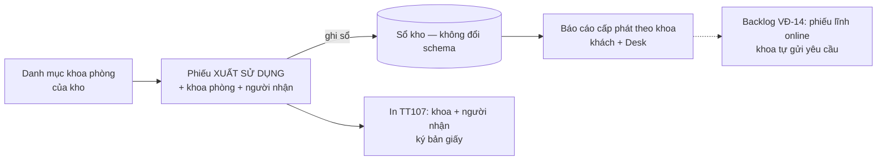

# PRD E8 — Cấp phát hoá chất – vật tư cho khoa phòng / cá nhân (QT4 mở rộng, QĐ-9)

| Meta | Nội dung |
|---|---|
| Phạm vi | UC-54, 55, 56 · BR-CP1…CP5 [MỚI] · NL-4.11…4.13 · VĐ-14 (backlog phiếu lĩnh) |
| Tham chiếu | BA §4.4 (đoạn Cấp phát), §6.9 · FormSpec F-16 (nhóm trường cấp phát), F-24, F-19 (tab cấp phát) |
| Phụ thuộc | Không phụ thuộc epic khác — làm được ngay sau E4 (khuyến nghị làm cùng đợt E4 vì chung màn phiếu xuất) |

## Mục tiêu
Biết **hoá chất – vật tư xuất ra đi về khoa nào, ai nhận** — trên chính phiếu Xuất sử dụng, không sinh
loại chứng từ mới. Báo cáo cấp phát theo khoa cho cả khách lẫn Miyano (đầu vào phân tích tiêu thụ
theo khoa về sau).

## User stories & AC

### US-E8.1 — Danh mục khoa phòng (UC-54, BR-CP1)
```gherkin
When thủ kho tạo khoa phòng "Khoa Hồi sức" trong kho của mình
Then khoa thuộc riêng kho đó; tên trùng tuyệt đối trong kho → chặn; gần giống → gợi ý chọn (NL-4.13)
When khoa đã dùng trên ≥1 phiếu
Then không xoá được, chỉ tắt active; khoa tắt không chọn được trên phiếu mới (NL-4.12)
And khách A không thấy khoa phòng của khách B (khuôn get_portal_kho — test cách ly)
```

### US-E8.2 — Cờ bắt buộc theo kho (BR-CP2)
```gherkin
Given Customer Warehouse.bat_buoc_khoa_phong = 0 (mặc định)
Then phiếu Xuất sử dụng: trường khoa phòng tuỳ chọn
When quản trị bật cờ = 1 lúc 10:00
Then phiếu tạo SAU 10:00 loại "Xuất sử dụng": thiếu khoa phòng → chặn ở before_submit (NL-4.11)
And phiếu NHÁP tạo trước 10:00 vẫn ghi sổ được không cần khoa (không khoá tồn đọng)
And các loại xuất khác (huỷ / trả lại / điều chỉnh) không bao giờ bắt buộc khoa
```

### US-E8.3 — Người nhận có gợi ý (UC-55, BR-CP3)
```gherkin
Given khoa "Khoa Hồi sức" từng có phiếu với người nhận "BS. Tuấn", "ĐD. Lan"
When thủ kho chọn khoa Hồi sức và gõ "t" vào ô Người nhận
Then kho_nguoi_nhan_goi_y trả gợi ý ["BS. Tuấn"] (lịch sử của CHÍNH khoa đó, 12 tháng gần nhất)
And vẫn nhập tên mới tự do được (không chặn) — ≤ 100 ký tự
```

### US-E8.4 — In phiếu & hiển thị (BR-CP5)
```gherkin
When in phiếu xuất có khoa phòng + người nhận
Then print format TT107/TT200 hiển thị khoa phòng và người nhận ở phần người nhận của mẫu
And danh sách phiếu xuất + nhật ký vật tư hiển thị/lọc được theo khoa phòng
```

### US-E8.5 — Báo cáo cấp phát theo khoa (UC-56, BR-CP4)
Bộ số chuẩn để viết test:
```
Kỳ 01–12/08: Khoa Hồi sức nhận 2 phiếu (Găng M: 8 hộp ×46.000; Cồn: 10 chai ×17.000) = 538.000
             Khoa Xét nghiệm nhận 1 phiếu (Găng M: 12 hộp ×46.000) = 552.000
             1 phiếu Xuất sử dụng KHÔNG gắn khoa (kho chưa bật bắt buộc): 5 hộp
→ Báo cáo: Hồi sức 538.000 · Xét nghiệm 552.000 · nhóm "Chưa gắn khoa" 230.000 tách riêng;
  % giá trị: 40,8% / 41,8% / 17,4%. Phiếu bị đảo không tính.
```
```gherkin
When chạy kho_bao_cao_cap_phat với dữ liệu trên
Then nhóm theo khoa đúng số; dòng "Chưa gắn khoa" tách riêng, không lẫn vào khoa nào
And drill từ dòng chi tiết mở đúng phiếu xuất; dữ liệu join sổ kho ↔ phiếu, KHÔNG đổi schema sổ (BR-CP4)
And report Desk tương ứng lọc theo khách, không rò sang khách khác
```

## Luồng (Mermaid)


## Dữ liệu & API
- Doctype mới `Customer Department` (`KP-.#####`): `kho` (Link, reqd), `ten_khoa_phong` (unique trong
  kho), `ma_khoa`, `ghi_chu`, `active` — không DocPerm cho role Customer.
- `Customer Warehouse` +`bat_buoc_khoa_phong` (Check, default 0).
- `Customer Stock Issue` +`khoa_phong` (Link Customer Department), +`nguoi_nhan` (Data ≤100).
  *(Thay thế trường `bo_phan_nhan` dự kiến trước đây — chưa code nên đổi spec trực tiếp.)*
- Endpoint mới: `kho_khoa_phong_list(tim_kiem, ca_inactive)` · `kho_khoa_phong_save(data)` (trả
  `goi_y_trung[]`) · `kho_nguoi_nhan_goi_y(khoa_phong, tu_khoa)` · `kho_bao_cao_cap_phat(tu_ngay,
  den_ngay, khoa_phong=None, vat_tu=None)` — cùng khuôn `get_portal_kho()`.
- `kho_phieu_xuat_save` mở rộng validate BR-CP2; `kho_phieu_list`/`kho_nhat_ky` thêm filter khoa.

## DoD
AC pass (nhóm TC-E8 trong `40_TestCases.md`, đúng bộ số chuẩn) · test cách ly 2 khách cho danh mục
khoa + báo cáo · print format có khoa/người nhận · patch idempotent · 339 test cũ xanh ·
không vi phạm CLAUDE.md (đặc biệt: không đổi schema sổ kho).
