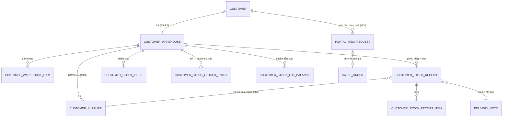

# 20_DataDict — Từ điển dữ liệu (chuẩn DocType/fieldtype Frappe v15)

Quy ước: fieldname tiếng Việt không dấu · label tiếng Việt có dấu · nhãn **[Hiện có]** = doctype đang
chạy, bảng chỉ liệt kê trường liên quan đã kiểm chứng trong BA — **Dev đối chiếu JSON doctype trong
repo trước khi sửa**; **[MỚI]** = đặc tả đầy đủ, là đích để build.

## 1. DocType mới [MỚI]

### 1.1 `Customer Supplier` — NCC khác của kho (naming: `NCC-.#####`)

| fieldname | Label | Fieldtype | Options/Target | reqd | unique | default | Ghi chú |
|---|---|---|---|---|---|---|---|
| kho | Kho | Link | Customer Warehouse | ✔ | — | — | NCC thuộc riêng một kho (BR-N3) |
| ten_ncc | Tên NCC | Data | — | ✔ | trong kho | — | Unique (kho, ten_ncc); so gần đúng khi tạo (NL-7.3) |
| mst | Mã số thuế | Data | — | — | — | — | 10 hoặc 13 chữ số nếu nhập |
| dien_thoai | Điện thoại | Data | — | — | — | — | — |
| email | Email | Data | options: Email | — | — | — | — |
| dia_chi | Địa chỉ | Small Text | — | — | — | — | — |
| ghi_chu | Ghi chú | Small Text | — | — | — | — | — |
| active | Hoạt động | Check | — | — | — | 1 | Đã dùng trên phiếu → không xoá, chỉ tắt |

Permissions: **KHÔNG DocPerm cho role Customer** — truy cập qua `kho_ncc_*` (khuôn `get_portal_kho()`).

### 1.1b `Customer Department` — Khoa phòng của kho (naming: `KP-.#####`) [E8 — QĐ-9]

| fieldname | Label | Fieldtype | Options/Target | reqd | unique | default | Ghi chú |
|---|---|---|---|---|---|---|---|
| kho | Kho | Link | Customer Warehouse | ✔ | — | — | Khoa thuộc riêng một kho (BR-CP1) |
| ten_khoa_phong | Tên khoa phòng | Data | — | ✔ | trong kho | — | ≤140; so gần đúng khi tạo (NL-4.13) |
| ma_khoa | Mã khoa | Data | — | — | — | — | ≤20, khớp mã nội bộ bệnh viện |
| ghi_chu | Ghi chú | Small Text | — | — | — | — | — |
| active | Hoạt động | Check | — | — | — | 1 | Đã dùng trên phiếu → không xoá, chỉ tắt |

Permissions: như 1.1 — truy cập qua `kho_khoa_phong_*`.

### 1.2 `Portal Item Request` — Yêu cầu hàng hoá (naming: `YCH-.#####`) **[Desk-only — đổi 15/08]**

> Doctype và toàn bộ trường dưới đây **vẫn đúng và vẫn chạy** — chỉ đổi ai thao tác. Từ 15/08 khách
> không còn tạo/xem/sửa bản ghi này qua cổng (route `/portal/yeu-cau*` và endpoint `portal_yeu_cau_*`
> đã gỡ, xem `30_API_Spec.md` §…, `FormSpec` F-22/F-23). Nhân viên Miyano tạo/xử lý trực tiếp trên
> Desk. Giá trị Select `loai` bên dưới **giữ nguyên** ("Bổ sung HĐNT" — không đổi theo tên gọi mới
> "hợp đồng khung", vì đây là dữ liệu đã lưu trên field, không phải chữ hiển thị cho khách).

| fieldname | Label | Fieldtype | Options/Target | reqd | default | Ghi chú |
|---|---|---|---|---|---|---|
| customer | Khách hàng | Link | Customer | ✔ | từ phiên | Server đặt, không nhận từ client |
| nguoi_yeu_cau | Người yêu cầu | Data | — | ✔ | session user | Email người dùng cổng |
| loai | Loại yêu cầu | Select | Bổ sung HĐNT\nBáo giá mua lẻ\nTìm nguồn hàng mới | ✔ | theo ngữ cảnh | — |
| ten_hang | Tên hàng hoá | Data | — | ✔ | — | ≤200; so gần đúng chống trùng (NL-11.1) |
| quy_cach | Quy cách đóng gói | Data | — | — | — | — |
| dvt | ĐVT | Data | — | ✔ | — | — |
| so_luong_du_kien | SL dự kiến | Float | — | ✔ | — | > 0 |
| tan_suat | Tần suất | Select | Một lần\nĐịnh kỳ | ✔ | Một lần | — |
| chu_ky_thang | Chu kỳ (tháng) | Int | — | khi Định kỳ | — | ≥ 1 |
| ngay_can | Ngày cần hàng | Date | — | — | +7 ngày | ≥ hôm nay |
| hang_xuat_xu | Hãng / xuất xứ | Data | — | — | — | — |
| ghi_chu | Ghi chú | Small Text | — | — | — | ≤1000 |
| vat_tu_kho | Vật tư kho khách | Link | Customer Warehouse Item | — | — | Khi tạo từ màn dự trù (E5) |
| trang_thai | Trạng thái | Select | Mới\nĐang tìm nguồn\nCần thêm thông tin\nĐã báo giá\nĐã có hàng\nĐã chuyển thành đơn\nKhông đáp ứng được\nKhách huỷ\nHết hạn | ✔ | Mới | Không xoá bản ghi (BR-Y4) |
| phan_hoi | Phản hồi Miyano | Small Text | — | — | — | — |
| gia_bao | Giá báo | Currency | — | — | — | — |
| lead_time_ngay | Lead time (ngày) | Int | — | — | — | — |
| item_lien_ket | Item liên kết | Link | Item | — | — | Item tạo từ yêu cầu (qua chuẩn hoá BR-Y3) |
| don_lien_ket | Đơn liên kết | Link | Sales Order | — | — | SO báo giá / SO chốt |
| ly_do_khong_dap_ung | Lý do không đáp ứng | Small Text | — | khi trạng thái đó | — | BR-Y2 |
| sla_den_han | Hạn phản hồi | Datetime | — | — | hệ tính | tạo + `sla_yeu_cau_gio` giờ làm việc |

Đính kèm: dùng File attach chuẩn Frappe, **is_private = 1**, ≤5 file ×10MB, pdf/jpg/png/xlsx (NL-11.6).
Permissions: như 1.1. Comment 2 chiều: dùng Comment chuẩn trên doctype, lộ qua endpoint.

### 1.2b `Sales Order Dat Ngoai Item` — dòng mua lẻ chưa có mã (naming: hash) **[MỚI — 15/08, §3.4]**

Child table của `Sales Order` (fieldname cha `custom_dat_ngoai`, xem §4). `Sales Order Item` bắt
buộc `item_code` (ràng buộc cứng ERPNext) nên dòng khách tự gõ tay KHÔNG THỂ là một dòng `items`
bình thường cho tới khi nhân viên khớp được mã hàng thật — đây là lý do có bảng con riêng.

| fieldname | Label | Fieldtype | Options/Target | reqd | Ghi chú |
|---|---|---|---|---|---|
| ten_hang | Tên hàng | Data | — | ✔ | Khách gõ tay |
| dvt | ĐVT | Data | — | ✔ | Khách gõ tay |
| so_luong | Số lượng | Float | — | ✔ | — |
| ghi_chu | Ghi chú | Small Text | — | — | — |
| item_khop | Mã hàng khớp | Link | Item | — | Nhân viên điền khi khớp được mã thật |
| da_xu_ly | Đã xử lý | Check | — | — | Bật khi đã khớp mã; còn dòng `da_xu_ly=0` → chưa xác nhận được đơn (§4.4) |

`allow_on_submit = 0` (mặc định) — không sửa được sau khi SO đã Submit, giữ chốt `before_submit`
(`portal_mua_le.kiem_dat_ngoai_da_xu_ly`) có tác dụng thật.

**Item kỹ thuật `HANG-DAT-NGOAI`** — "Hàng đặt ngoài (chờ Miyano khớp mã)", `is_stock_item = 0`,
`is_sales_item = 1`, `is_purchase_item = 0`, có `item_defaults.default_warehouse`. Chèn tự động vào
dòng `items` của một SO Mua lẻ **chỉ khi** không còn dòng `items` thật nào (SO không lưu được với
`items` rỗng — ràng buộc ERPNext). **Không bao giờ** hiển thị cho khách: lọc tại nguồn bằng
`la_dong_giu_cho()` ở chi tiết đơn (`portal_order_track`) và mọi mẫu in liên quan.

### 1.3 `Miyano Portal Settings` — Single DocType

| fieldname | Label | Fieldtype | default | Dùng bởi |
|---|---|---|---|---|
| nguong_duyet_2_tang | Ngưỡng duyệt 2 tầng | Currency | *(trống = 1 tầng)* | E2 · VĐ-8 chốt số |
| sla_xu_ly_don_gio | SLA xử lý đơn (giờ làm việc) | Int | 8 | E2 |
| price_list_ban_le | Price List bán lẻ | Link → Price List | — | E6 · *field còn tồn tại nhưng không còn đọc ở đường danh mục mua lẻ từ 15/08 (VĐ-12 đã tan — danh mục không hiện giá)* |
| hieu_luc_bao_gia_ngay | Hiệu lực báo giá (ngày) | Int | 7 | E6 |
| sla_yeu_cau_gio | SLA yêu cầu hàng hoá (giờ làm việc) | Int | 48 | E6 |
| so_ngay_adu | Kỳ tính ADU (ngày) | Int | 90 | E5 |
| so_ngay_du_lieu_toi_thieu | Số ngày dữ liệu tối thiểu | Int | 30 | E5 |
| nguong_cham_luan_chuyen_ngay | Ngưỡng chậm luân chuyển (ngày) | Int | 90 | E4 |

Chỉ `System Manager` sửa.

## 2. Trường MỚI trên doctype kho [Hiện có, mở rộng]

### 2.1 `Customer Warehouse Item` (+6)

| fieldname | Label | Fieldtype | default | Ghi chú |
|---|---|---|---|---|
| ton_toi_thieu | Tồn tối thiểu (min) | Float | — | ≥ 0 |
| diem_dat_lai | Điểm đặt lại (ROP) | Float | — | min ≤ ROP ≤ max (validate) |
| ton_toi_da | Tồn tối đa (max) | Float | — | — |
| lead_time_ngay | Lead time (ngày) | Int | 3 | 1–60 |
| boi_so_dat | Bội số đặt | Int | — | > 0; dùng BR-P4 |
| adu_90 | ADU 90 ngày | Float | read-only | Hệ tính, cache hiển thị |

### 2.2 `Customer Stock Receipt` (+7) & `Customer Stock Receipt Item` (+3)

| Doctype | fieldname | Label | Fieldtype | Ghi chú |
|---|---|---|---|---|
| Receipt | loai_nhap *(sửa options)* | Loại nhập | Select | + `Mua ngoài (NCC khác)` + `Điều chỉnh kiểm kê (tăng)`; "Phiếu đảo" giữ nguyên chỉ hệ tạo (BR-K9) |
| Receipt | ncc | NCC | Link → Customer Supplier | reqd khi Mua ngoài (BR-N1); filter theo kho + active |
| Receipt | so_chung_tu_ncc | Số chứng từ NCC | Data | không bắt buộc (BR-N2) |
| Receipt | ngay_chung_tu | Ngày chứng từ | Date | ≤ ngày phiếu |
| Receipt | so_dot | Đợt (thứ tự DN trong SO) | Int | read-only, hook đặt (BR-K16) |
| Receipt | co_chenh_lech | Có chênh lệch | Check | read-only, hệ đặt khi ghi sổ (BR-K17) |
| Receipt | thieu_chung_tu | Thiếu chứng từ | Check | read-only, hệ đặt (NL-7.2) |
| Receipt Item | sl_giao | SL giao (theo DN) | Float | read-only, hook điền |
| Receipt Item | ly_do_chenh_lech | Lý do chênh lệch | Data | reqd khi so_luong ≠ sl_giao (nguồn Miyano) |
| Receipt Item | thieu_lo_han | Thiếu lô/hạn | Check | read-only (NL-3.7) |

### 2.3 `Customer Stock Issue` (+3) & `Customer Warehouse` (+1)

| Doctype | fieldname | Label | Fieldtype | Ghi chú |
|---|---|---|---|---|
| Issue | xac_nhan_xuat_het_han | Xác nhận xuất lô quá hạn | Check | reqd khi "Xuất sử dụng" có lô quá hạn (BR-K20) |
| Issue | khoa_phong | Khoa phòng nhận | Link → Customer Department | reqd khi kho bật `bat_buoc_khoa_phong` và loại "Xuất sử dụng" (BR-CP2, NL-4.11); filter theo kho + active. *Thay trường `bo_phan_nhan` dự kiến trước đây* |
| Issue | nguoi_nhan | Người nhận | Data | ≤100; autocomplete từ lịch sử của khoa (BR-CP3) |
| Warehouse | bat_buoc_khoa_phong | Bắt buộc khoa phòng khi xuất sử dụng | Check | default 0 (BR-CP2 — E8) |

## 3. Ghi chú doctype [Hiện có] — KHÔNG đổi schema trong các epic này

`Customer Warehouse` (KKH-.#####, `customer` unique — BR-K1) · `Customer Stock Ledger Entry`
(SKK-.#########, append-only, có `da_dao`) · `Customer Stock Lot Balance` (cache) ·
`Customer Stock Issue Item`. Trường hiện hữu: đối chiếu JSON trong repo.

## 4. Custom fields trên doctype ERPNext (cài bằng patch `create_*_custom_fields`)

| Doctype | fieldname | Fieldtype | Ghi chú |
|---|---|---|---|
| Sales Order | custom_nguon_don · custom_hdnt · custom_so_po_khach · custom_yeu_cau_khach | *(đang có)* | [Hiện có] |
| Sales Order | custom_request_id | Data, **unique** | BR-O12 (E1) |
| Sales Order | custom_ly_do_tu_choi | Small Text | BR-O14 (E2) |
| Sales Order | custom_loai_don | Select: Theo HĐNT\nMua lẻ | default "Theo HĐNT" (E6). *Giá trị lưu KHÔNG đổi theo tên gọi mới 15/08 — dữ liệu, không phải chữ hiển thị; label field `custom_hdnt` đã đổi thành "Hợp đồng khung"* |
| Sales Order | custom_yeu_cau_goc | Link → Portal Item Request | E6 |
| Sales Order | custom_dat_ngoai | Table → `Sales Order Dat Ngoai Item` | §3.4, 15/08 — xem §1.2b |
| Customer | custom_cho_phep_mua_le | Check, default **1** | BR-R1 (E6). *Đổi từ 0 → 1 ở patch `v1_15.bat_mua_le_mac_dinh` (15/08); khách hiện hữu được UPDATE, sales vẫn tắt được thủ công cho khách cụ thể* |
| Item | custom_ban_le_portal | Check, default 0 | BR-R6 (E6). *Từ 15/08 không còn dùng để lọc danh mục mua lẻ (danh mục = toàn bộ Item hoạt động) — field vẫn tồn tại, không xoá* |
| Sales Invoice | einvoice_* *(tên tạm)* | xem PRD E7 | **map lại sau VĐ-11 — viết adapter** |

## 5. Quan hệ chính (trạng thái đích)

